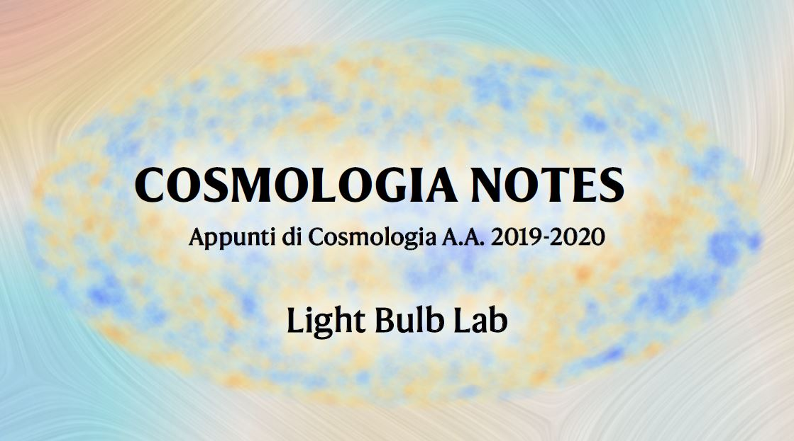

### Indice
1. **Introduzione**: metrica e distanze
2. **Universi di Friedmann**: equazioni di Friedmann e soluzioni, orizzonte cosmologico
3. **Evoluzione termica dell'Universo**: temperatura e redshift pre e post disaccoppiamento
4. **Cinque problemi del Modello Standard**: origine, orizzonte, piattezza, monopoli magnetici e costante cosmologica
5. **Storia cronologica dell'Universo**: modello di Guth, inflazione caotica, era adronica, leptonica, nucleosintesi primordiale
6. **Un universo... Perturbato**: formazione delle strutture, teoria di Jeans classica e cosmologica
7. **Un'oscillazione non è per sempre**: hot N cold dark matter, free streaming e dissipazione
8. **Statistica con un oggetto**: proprietà stocastiche delle perturbazioni, spettro di Zeldovich
9. **Evoluzione non lineare**: approssimazione di Zeldovich, virializzazione, teoria di Press-Schechter, simulazioni numeriche
10. **Clustering**: funzione di correlazione angolare, risultati osservativi
11. **Cosmic Microwave Background**: anisotropie primarie e secondarie, risultati osservativi
12. **Dalla letteratura**: articoli e approfondimenti
